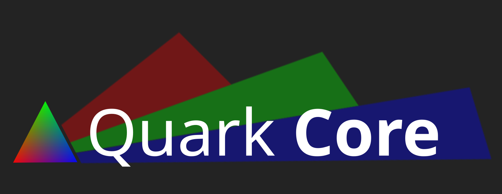

<div align="center">


<b>A rendering library built for the Quark Engine<br></b>

[](https://isocpp.org/)
[](https://www.opengl.org/)
[](https://www.vulkan.org/)
[](#license)

</div>

---

## Quick Start

### Requirements

- C++17 or later
- OpenGL 3.3+
- CMake 3.16+

### Installation

```bash
git clone https://github.com/Quark-Engine/QuarkCore.git
cd QuarkCore
cmake -B build -DCMAKE_BUILD_TYPE=Release
cmake --build build
```

Then link against `QuarkCore` in your `CMakeLists.txt`:

```cmake
target_link_libraries(your_target PRIVATE QuarkCore)
```

---

## Usage

```cpp
#include "QuarkCore/QuarkCore.hpp"

int main() {
    qc::InitWindow(1280, 720, "Hello World", qc::RendererType::OpenGL);
    qc::SetTargetFPS(60);

    while (!qc::WindowShouldClose()) {
        qc::BeginDrawing();
        qc::ClearBackground(qc::Color{20, 24, 32, 255});

        qc::DrawText("Hello, World!", 360, 340, 32, qc::WHITE);

        qc::EndDrawing();
    }

    qc::CloseWindow();
    return 0;
}
```

---

## API Overview

The table covers the public functions declared by the QuarkCore headers.
Overloads are grouped under the same function name.

| Category | Functions |
|---|---|
| **Window and Backend** | `InitWindow`, `CloseWindow`, `WindowShouldClose`, `GetCurrentBackend`, `SetMSAASamples`, `SetTextureFilterMode`, `SetTargetFPS`, `SetVSync`, `IsWindowReady`, `SetWindowTitle`, `GetWindowTitle`, `SetWindowPosition`, `GetWindowPosition`, `SetWindowSize`, `GetWindowSize`, `GetWindowSizeInPixels`, `SetWindowMinimumSize`, `GetWindowMinimumSize`, `SetWindowMaximumSize`, `GetWindowMaximumSize`, `SetWindowResizable`, `SetWindowBordered`, `SetWindowFullscreen`, `ToggleFullscreen`, `ShowWindow`, `HideWindow`, `RaiseWindow`, `MaximizeWindow`, `MinimizeWindow`, `RestoreWindow`, `SyncWindow`, `IsWindowFullscreen`, `IsWindowHidden`, `IsWindowMinimized`, `IsWindowMaximized`, `IsWindowFocused`, `IsWindowMouseFocused`, `IsWindowResizable`, `IsWindowBorderless`, `GetWindowDisplayScale`, `GetWindowPixelDensity`, `SetWindowIcon`, `GetNativeWindow`, `GetNativeContext`, `GetNativeEvent` |
| **Vulkan** | `GetVulkanInstance`, `GetVulkanPhysicalDevice`, `GetVulkanDevice`, `GetVulkanGraphicsQueueFamily`, `GetVulkanGraphicsQueue`, `GetVulkanDescriptorPool`, `GetVulkanMainRenderPass`, `GetVulkanMinImageCount`, `GetVulkanImageCount`, `GetVulkanMSAASamples`, `GetVulkanTextureDescriptorSet`, `SetVulkanRenderCallback`, `GetVulkanRenderCallback` |
| **Events and Text Input** | `PollEvent`, `WaitEvent`, `WaitEventTimeout`, `SetNativeEventCallback`, `GetEventTypeName`, `StartTextInput`, `StopTextInput`, `IsTextInputActive` |
| **Timing, Logging, and Screen** | `SetLogLevel`, `TraceLog`, `TextFormat`, `GetFrameTime`, `GetDeltaTime`, `GetFPS`, `GetTime`, `GetScreenWidth`, `GetScreenHeight`, `GetCurrentMonitorRefreshRate`, `WaitTime`, `GetRandomValue`, `SetRandomSeed` |
| **Input** | `IsKeyDown`, `IsKeyPressed`, `IsKeyReleased`, `IsKeyUp`, `GetKeyPressed`, `GetCharPressed`, `SetExitKey`, `IsMouseButtonDown`, `IsMouseButtonPressed`, `IsMouseButtonReleased`, `IsMouseButtonUp`, `GetMousePosition`, `GetMouseX`, `GetMouseY`, `GetMouseWheelMoveV`, `GetMouseWheelMove`, `GetMouseDelta`, `SetMousePosition`, `DisableCursor`, `EnableCursor`, `IsCursorHidden`, `SetMouseCursor`, `GetGamepadCount`, `IsGamepadAvailable`, `GetGamepadName`, `GetGamepadAxisCount`, `GetGamepadAxisMovement`, `IsGamepadButtonDown`, `IsGamepadButtonPressed`, `IsGamepadButtonReleased`, `IsGamepadButtonUp`, `GetGamepadButtonPressed`, `SetGamepadAxisDeadZone`, `GetGamepadAxisDeadZone`, `SetGamepadVibration`, `SetGamepadMappings`, `AddGamepadMapping`, `GetGamepadMapping` |
| **Drawing and Cameras** | `BeginDrawing`, `EndDrawing`, `ClearBackground`, `CreateCamera2D`, `CreateCamera3D`, `GetCameraMat4`, `BeginMode2D`, `EndMode2D`, `BeginMode3D`, `EndMode3D`, `BeginTextureMode`, `EndTextureMode`, `GetScreenToWorld2D`, `GetWorldToScreen2D`, `GetWorldToScreen`, `GetScreenToWorldRay`, `GetMatrixModelview`, `GetMatrixProjection`, `PushMatrix`, `PopMatrix`, `Translate`, `Rotate`, `Scale`, `MultMatrix`, `EnableBackfaceCulling`, `DisableBackfaceCulling` |
| **2D Primitives and Colors** | `DrawRectangle`, `DrawRectangleV`, `DrawRectangleLines`, `DrawRectangleRounded`, `DrawCircle`, `DrawCircleLines`, `DrawEllipse`, `DrawLine`, `DrawLineV`, `DrawTriangle`, `DrawPoly`, `Fade`, `ColorAlpha`, `ColorTint`, `ColorBrightness`, `ColorContrast`, `GetColor`, `ColorFromNormalized`, `CheckCollisionRecs`, `CheckCollisionCircles`, `CheckCollisionPointRec`, `CheckCollisionPointCircle` |
| **Textures and Fonts** | `LoadTexture`, `IsTextureValid`, `IsTextureReady`, `UnloadTexture`, `LoadRenderTexture`, `IsRenderTextureValid`, `GetRenderTextureTexture`, `UnloadRenderTexture`, `GenCheckerTexture`, `UnloadVertexArray`, `UnloadVertexBuffer`, `GetDefaultFont`, `LoadFont`, `UnloadFont`, `DrawTexture`, `DrawTextureV`, `DrawTextureEx`, `DrawTextureRec`, `DrawTextureTiled`, `DrawTexturePro`, `DrawTextureNPatch`, `DrawText`, `DrawTextEx`, `MeasureText`, `MeasureTextEx` |
| **Shaders** | `LoadShader`, `LoadShaderFromMemory`, `IsShaderValid`, `IsShaderReady`, `GetShaderLocation`, `GetShaderAttributeLocation`, `SetShaderValue`, `SetShaderValueV`, `SetShaderValueMatrix`, `SetShaderValueSampler`, `SetShaderValueTexture`, `SetShaderValueTextureUnit`, `Set3DLightEnabled`, `BeginShaderMode`, `EndShaderMode`, `UnloadShader` |
| **3D Meshes and Models** | `SetMaterialColor`, `UploadMesh`, `UpdateMeshBuffer`, `UnloadMesh`, `DrawMesh`, `DrawMeshInstanced`, `GetMeshBoundingBox`, `GetModelBoundingBox`, `GenMeshTangents`, `ExportMesh`, `ExportMeshAsCode`, `GenMeshPoly`, `GenMeshPlane`, `GenMeshCube`, `GenMeshSphere`, `GenMeshHemiSphere`, `GenMeshCylinder`, `GenMeshCone`, `GenMeshTorus`, `GenMeshKnot`, `GenMeshHeightmap`, `GenMeshCubicmap`, `LoadModel`, `LoadModelFromMesh`, `LoadMaterialDefault`, `UnloadModel`, `DrawModel`, `DrawModelEx`, `DrawModelWires`, `DrawModelWiresEx`, `DrawBoundingBox`, `GetRayCollisionTriangle`, `GetRayCollisionBox` |
| **3D Primitives** | `Set3DView`, `DrawPlane`, `DrawCube`, `DrawCubeV`, `DrawCubeWires`, `DrawCubeWiresV`, `DrawSphere`, `DrawSphereEx`, `DrawSphereWires`, `DrawCylinder`, `DrawCylinderEx`, `DrawCylinderWires`, `DrawCylinderWiresEx`, `DrawLine3D`, `DrawGrid`, `DrawBillboard`, `DrawBillboardRec`, `DrawBillboardPro` |
| **Lights** | `CreateLight`, `UpdateLightValues` |
| **Math Helpers** | `Clamp`, `Lerp`, `SmoothStep`, `ToRadians`, `ToDegrees`, `Normalize`, `MoveTowards`, `Sign`, `Vec2Zero`, `Vec2One`, `Vec2Add`, `Vec2Subtract`, `Vec2Scale`, `Vec2Length`, `Vec2Normalize`, `Vec2Distance`, `Vec3Zero`, `Vec3One`, `Vec3Add`, `Vec3Subtract`, `Vec3Normalize`, `Vec3Transform`, `Vec3Distance`, `Mat4Identity`, `MatrixIdentity`, `Mat4Translate`, `MatrixTranslate`, `Mat4Scale`, `MatrixScale`, `Mat4RotateXYZ`, `MatrixRotateXYZ`, `Mat4Multiply`, `MatrixMultiply`, `Mat4Invert`, `MatrixInvert`, `Mat4Perspective`, `Mat4PerspectiveVulkan`, `MatrixPerspective`, `Mat4Transpose`, `MatrixTranspose`, `Vec3::dot`, `Vec3::cross`, `Vec3::length`, `Vec3::normalized`, `Vec4::dot`, `Vec4::length`, `Vec4::normalized`, `Mat4::identity`, `Mat4::translation`, `Mat4::scale`, `Mat4::rotationX`, `Mat4::rotationY`, `Mat4::rotationZ`, `Mat4::perspective`, `Mat4::perspectiveVulkan`, `Mat4::lookAt`, `Mat4::ortho`, `Mat4::inverted` |
| **Files and Directories** | `FileRename`, `FileRemove`, `FileCopy`, `FileMove`, `FileTextReplace`, `FileTextFindIndex`, `FileExists`, `DirectoryExists`, `IsFileExtension`, `GetFileLength`, `GetFileModTime`, `GetFileExtension`, `GetFileName`, `GetFileNameWithoutExt`, `GetDirectoryPath`, `GetPrevDirectoryPath`, `GetWorkingDirectory`, `GetApplicationDirectory`, `MakeDirectory`, `ChangeDirectory`, `IsPathFile`, `IsFileNameValid`, `LoadDirectoryFiles`, `LoadDirectoryFilesEx`, `UnloadDirectoryFiles`, `IsFileDropped`, `LoadDroppedFiles`, `UnloadDroppedFiles`, `GetDirectoryFileCount`, `GetDirectoryFileCountEx` |

---

## Built-in Shader Constants

QuarkCore exposes its default vertex shader source so you can pair it with any custom fragment shader:

```cpp
qc::LoadShaderFromMemory(qc::kVertexShaderSource, myFragmentShader);
```

---

## Examples

The `examples/` directory contains demos for:

- `sandbox.cpp` — window setup, 2D/3D cameras, render textures, text rendering
- `shaders.cpp` — chromatic aberration, pixelation, vignette, scanlines with live parameter tuning

---

<div align="center">

Made for the **[Quark Engine](https://github.com/Quark-Engine/QuarkEngine)**

</div>
